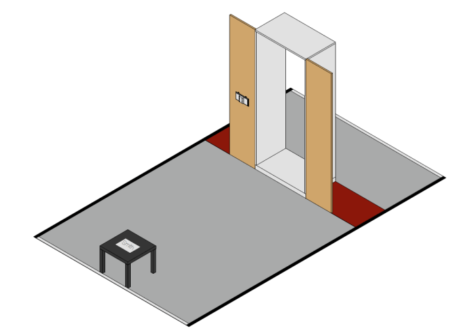
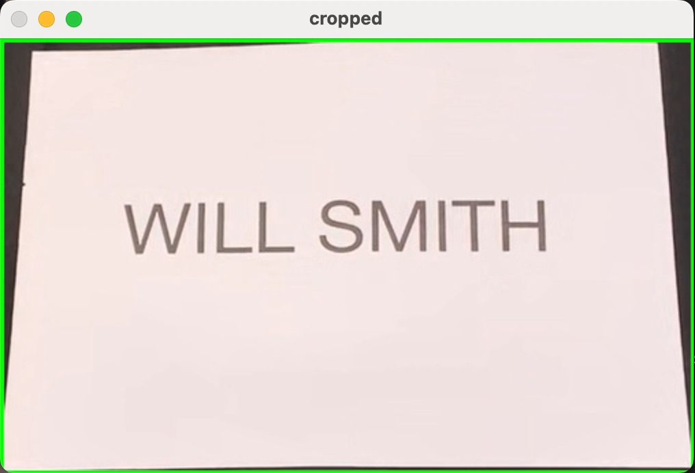
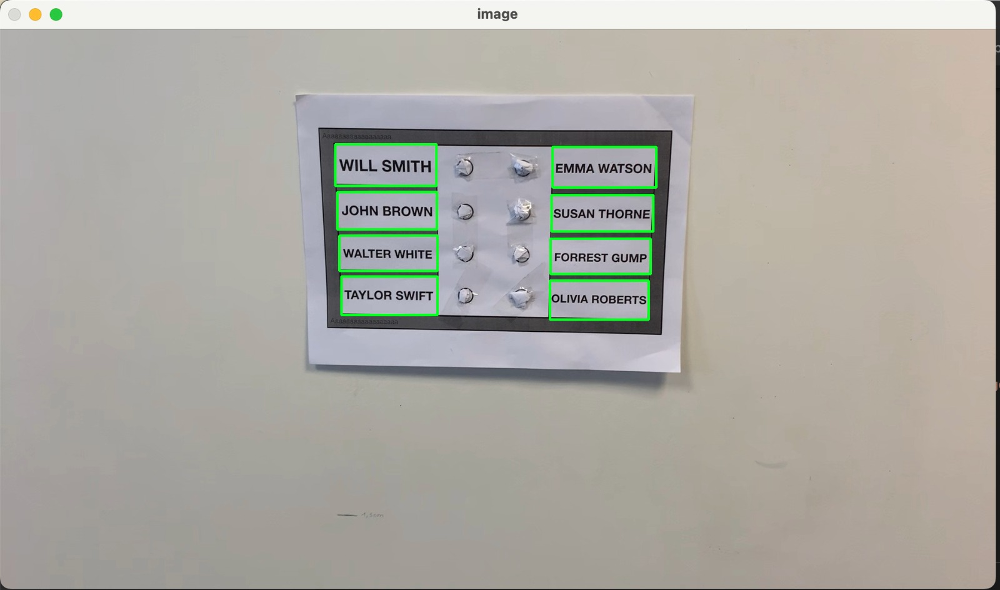

[![Badge License]][license]

<div align = center>

# Front Door

_Assistant Professor: Fabien Vérité_ <br>
_Course of Designing Mechatronic systems for health_ <br>
_Sorbonne Université, Paris_

<br>

## Team

![Badge nicola]
![Badge matilde]
![Badge federico]
[![Badge sofia]][sofia]

<br>

## Table of Contents

<div align = left>

- [1. Context](#1-context)

- [2. Requirements](#2-requirements)

- [3. Code](#3-code)
  - [3.a Recognition of the name](#3a-recognition-of-the-name)
    - [3 Run the project](#311-run-the-project)
    - [3.1.2 Results and Code link](#312-results-and-code-link)
  - [3.b Mapping of the doorbell](#3b-mapping-of-the-doorbell)
    - [3.2.1 Run the project](#321-run-the-project)
    - [3.2.2 Results and Code link](#322-results-and-code-link)
  - [3.c Ringing the correct name](#3c-ringing-the-correct-name)
    - [3.3.1 Run the project](#331-run-the-project)
    - [3.3.2 Results and code link](#332-results-and-code-link)
- [4. Adjustments to run the project on Windows OS](#4-adjustments-to-run-the-project-on-windows-os)

# 1. Context

<div align = left>

This project aims to help people with vision impairment to ring a doorbell by means of a camera on the forehead. This task is also object of the Cybathlon, a non-profit project of ETH Zurich which challenges teams from all over the world to develop assistive technologies suitable for everyday use with and for people with disabilities.

In this challenge, the person has to read the name to ring on a piece of paper on a table; then, he has to turn back and go to the doorbell to ring the correct label.

<center></center>

<a name="requirements"></a>

# 2. Requirements

The project runs on Python 3. The requirements are listed in the file <a href="https://github.com/sofiatoss/FrontDoor/blob/main/requirements.txt">requirements.txt</a> and can be installed by running `pip install -r /requirements.txt`.

The code has been run on a MacBook Pro 13", 2017, 2.3 GHz Intel Core i5 dual-core, macOS Ventura 13.0. The camera is the one of an iPhone XS,
iOS 16.2, connected to the laptop through Continuity Camera.

The whole project can also be run on a Windows laptop and an Android smartphone, by installing the Iriun Webcam application on both them and changing a few lines of code.

# 3. Code

The Python file to run in order to execute the project is <a href="https://github.com/sofiatoss/FrontDoor/blob/main/src/MAIN_.py">MAIN\_.py</a>. In general, the task can be splitted into three phases:

- the first phase consists in the recognition of the name written on the a4 paper and its communication to the user; in this part of the challenge, the user has to be stooped down in front of the paper. It's denoted as `flag == -1` in the code.
- in the second phase, the user is in front of the doorbell waiting for its mapping, e.g the recognition of each name and of the corresponding positions. The location of the desired name (read before) is communicated to the user. This phase is denoted as `flag == 0` in the code.
- in the third and last part, the user, touching the doorbell, understands where he has to push; with his index finger, he has to touch the correct button and wait for a confirmation of the program, which localize its finger and reads the closest label. This phase is denoted as `flag == 1` in the code.

## 3.a Recognition of the name

In the first phase, the rectangle of the paper is identified in the image. In order to do that, the function `find_init_rect` (in <a href="https://github.com/sofiatoss/FrontDoor/blob/main/src/FIND_INITIAL_RECT.py">FIND_INITIAL_RECT.py</a>) is used. This function finds all the rectangle in the image and, when it's able to find just one rectangle with a certain area and proportion, it crops it and reads the name inside it. The name is thought to be correct and definitive when it's uppercase (as all the names used) and it's read twice in the same way. When this happens, it's told to the user, who can pass to the next phase. The name read is stored to be used later.


<center></center>

## 3.b Mapping of the doorbell

In the second phase, the user stays in front of the doorbell and the image is processed.

<center></center>

In particular, eight rectangles of a precise dimension and proportion are searched. In order to do that, the function `recogn_rect` (in <a href="https://github.com/sofiatoss/FrontDoor/blob/main/src/recognizing_rectangles.py">recognizing_rectangles.py</a>) is used. It returns the 2D coordinates of the centroids of the eight rectangles and their heights and weights.

```
X_CENTROIDS, Y_CENTROIDS, H, W = recogn_rect(image)
```

Then, these coordinates are passed to the function `analyse_doorbell` (in <a href="https://github.com/sofiatoss/FrontDoor/blob/main/src/ANALYSE_DOORBELL.py">ANALYSE_DOORBELL.py</a>), together with the current image of the doorbell and the string to be recognized on it (found before). The first thing it does is sorting the rectangles coordinates from the left to the right and from the upper part of the image to the lower one. This is done by the function `centroid_sort` (in <a href="https://github.com/sofiatoss/FrontDoor/blob/main/src/centroide_sort.py">centroide_sort.py</a>)

```
X_CENTROIDS_SORTED, Y_CENTROIDS_SORTED, W_SORTED, H_SORTED = centroid_sort(X_CENTROIDS, Y_CENTROIDS, H, W)
```

which recognizes firstly the rectangle having the smallest sum of coordinates (which corresponds to the upper left one, in fact the reference frame is on the high left vertex of the image) and then, after having removed it, the highest one, this repeated four times.

```
for i in range(4):

    # find the first value on the row
    sumcen = []
    for j in range(len(X_CENTROIDS)):
        sumcen.append(X_CENTROIDS[j]+Y_CENTROIDS[j])

    ind_uno = sumcen.index(min(sumcen))
    X_SORTED.append(X_CENTROIDS[ind_uno])
    Y_SORTED.append(Y_CENTROIDS[ind_uno])
    H_SORTED.append(H[ind_uno])
    W_SORTED.append(W[ind_uno])

    X_CENTROIDS.remove(X_CENTROIDS[ind_uno])
    Y_CENTROIDS.remove(Y_CENTROIDS[ind_uno])
    H.remove(H[ind_uno])
    W.remove(W[ind_uno])

    # find the second value on the row
    ind_sec = Y_CENTROIDS.index(min(Y_CENTROIDS))
    X_SORTED.append(X_CENTROIDS[ind_sec])
    Y_SORTED.append(Y_CENTROIDS[ind_sec])
    H_SORTED.append(H[ind_sec])
    W_SORTED.append(W[ind_sec])

    X_CENTROIDS.remove(X_CENTROIDS[ind_sec])
    Y_CENTROIDS.remove(Y_CENTROIDS[ind_sec])
    H.remove(H[ind_sec])
    W.remove(W[ind_sec])

```

In the `analyse_doorbell` function, after having sorted the rectangles, they are cropped and the names inside are read: they are stored in a list, which is processed by the function `compare_str` (in <a href="https://github.com/sofiatoss/FrontDoor/blob/main/src/compare_string.py">compare_string.py</a>), which used the \_SequenceMatcher\* library in order to find the position of the string which is the most similar to the one read in the previous part. The location of the corresponding rectangle (0 to 7) is returned by the function.

```
# compares the strings and finds the most similar one
pos_max_ratio = compare_str(
    X_CENTROIDS_SORTED, Y_CENTROIDS_SORTED, H_SORTED, W_SORTED, STRINGS, string_to_find)
```

Through a dictionary, each rectangle is mapped with a string corresponding to the instruction to provide in order to find it.

```
# dictionary of the cells and instructions
cell_descriptions = {
    0: 'First cell from the top left',
    2: 'Second cell from the top left',
    4: 'Third cell from the top left',
    6: 'Fourth cell from the top left',
    1: 'First cell from the top right',
    3: 'Second cell from the top right',
    5: 'Third cell from the top right',
    7: 'Fourth cell from the top right'
}
```

This string is read to the user, together with other instruction, in order to help him finding the correct label to ring.

## 3.c Ringing the correct name

In the last phase, the image is processed by the function `get_min_dist` (in <a href="https://github.com/sofiatoss/FrontDoor/blob/main/src/get_distance.py">get_distance.py</a>); inside this function, the coordinate of the index finger (given by the function `index_xy`) are combined with the rectangles' ones in order to find the coordinates of the rectangle at the minimum distance from the finger, returned as output.

<center></center>

```
# computes all the distances
DISTANCES = []
for i in range(0, len(X_CENTROIDS)):
    d = math.sqrt((x_fing - X_CENTROIDS[i])
                    ** 2 + (y_fing - Y_CENTROIDS[i])**2)
    DISTANCES.append(d)

# finds the position of the minimum distance
posmin = DISTANCES.index(min(DISTANCES))
x = X_CENTROIDS[posmin]
y = Y_CENTROIDS[posmin]
h = H[posmin]
w = W[posmin]
```

In order to recognize the finger, an essential requirement is that the wrist is visible: in fact, MediaPipe is a pipeline that firstly recognizes the finger and then, based on its position, identifies the palm and the fingers. If the wrist is not visible in the image, a message is provided to the user asking him to tilt his head down a little.

After having recognized the rectangle the user is pointed to, the name written inside it is read and compared to the one found in the first phase: if they are enough similar (more than 70% of similarity), it means that he's pointing to the right cell and he's asked to ring.

# 4. Adjustments to run the project on Windows OS

In order to run the project in Windows OS, a few steps have to be followed:

- _pytesseract_ requires to be imported in the following way:

  ```
  import pytesseract
  pytesseract.pytesseract.tesseract_cmd = r'C:\Program Files\Tesseract-OCR\tesseract.exe'
  ```

- when using _gtts_ in order to reproduce a mp3 audio, the line:

  ```
  os.system("afplay example1.mp3")
  ```

  has to be substituted by

  ```
  os.system("start example1.mp3")
  ```
  
  in the whole code.

- the third part application _Iriun Webcam_ has to be installed on both smartphone and laptop; to make it work, the smartphone's one has to be launched as first.

<!----------------------------------{ Images }--------------------------------->

[image1]: README_IMG/FrontDoorChallenge.png
[image2]: README_IMG/RECOGN.jpeg
[image3]: README_IMG/MAPPING.jpeg
[image4]: README_IMG/RING.jpeg

<!----------------------------------------------------------------------------->

[sofia]: https://github.com/sofiatoss
[license]: LICENSE

<!---------------------------------{ Badges }---------------------------------->

[badge license]: https://img.shields.io/badge/LICENSE-MIT-yellow
[badge nicola]: https://img.shields.io/badge/-NICOLA%20ABENI-critical
[badge sofia]: https://img.shields.io/badge/-SOFIA%20TOSCANO%20-brightgreen
[badge federico]: https://img.shields.io/badge/-FEDERICO%20TISI-blue
[badge matilde]: https://img.shields.io/badge/-MATILDE%20GAIOLAS-ff69b4
